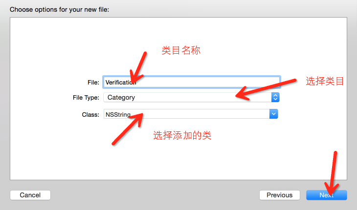

#类目

##概念

有些时候我们需要为一些类添加一些方法,这个时候一般我们会采取继承这个类,然后去添加自己特殊的方法,然后在OC中,NSString就不允许我们进行继承,但有些时候我们又需要为其添加方法,这个时候我们就需要采取类目,为其添加方法.

注意:

* 为<font color = "red">已知的类</font>添加方法
* 不能直接在类目中添加属性

下面我们来为NSString添加一个验证邮箱的方法

首先我们创建一个类目




然后我们会发现有这样的一个类


我们进入.h文件

```objc

#import <Foundation/Foundation.h>

@interface NSString (Verification)

- (BOOL)verifyEmail;

@end

```

实现文件

```objc
#import "NSString+Verification.h"

@implementation NSString (Verification)

- (BOOL)verifyEmail
{
    // 写出邮箱正则表达式
    NSString *emailRegex = @"[A-Z0-9a-z._%+-]+@[A-Za-z0-9.-]+\\.[A-Za-z]{2,4}";
    // 利用谓词进行匹配
    NSPredicate *emailTest = [NSPredicate predicateWithFormat:@"SELF MATCHES %@", emailRegex];
    // 利用谓词进行检查
    return [emailTest evaluateWithObject:self];
}

@end
```

最后在main函数中测试,首先导入相应的文件

```objc
#import <Foundation/Foundation.h>
#import "NSString+Verification.h"

int main(int argc, const char * argv[]) {
    @autoreleasepool {
        
        NSString *email1 = @"123@qq";
        
        if ([email1 verifyEmail]) {
            NSLog(@"这是一个有效的邮箱格式");
        } else {
            NSLog(@"这不是一个有效的格式");
        }
        
    }
    return 0;
}


```


可以发现NSString中已经拥有这个方法了.