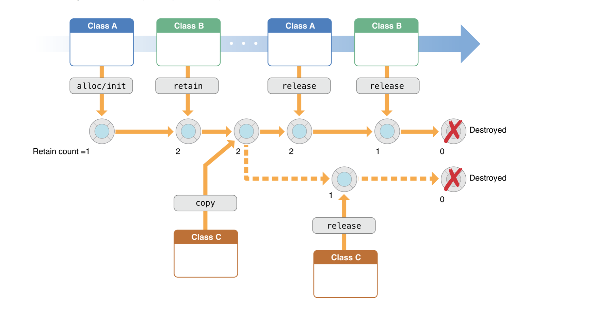

#内存管理

说到内存管理就不得不提到ARC(Automatic Reference Counting)模式以及手动管理(Reference counting manually), 我们现在使用的代码都是让系统帮我们管理内存,但是我们有时需要了解到内存到底是怎么分配的,才能解决我们所碰到的一些问题,比如后面大家会遇到的block内存管理等等

##为什么要管理内存

由于移动设备的内存极其有限，所以每个APP所占的内存也是有限制的，当app所占用的内存较多时，系统就会发出内存警告，这时需要回收一些不需要再继续使用的内存空间，比如回收一些不再使用的对象和变量等。

##内存管理机制

###引用计数(retain count)

* 每个对象都拥有一个引用计数(4个字节用以存储)
* 在OC中一旦对象创建出来,引用技术默认为1
* 引用计数为0的时候,对象就会被销毁.

如图所示:




当对象释放的时候,在NSObject中定义的一个方法dealloc会自动调用,所以我们需要在这里管理相应的内存

##内存管理基本规则

首先说一个对象可以被多次持有,只要该对象被持有,则会继续存在.假如没有被持有了,runtime机制会自动帮我们进行销毁,以下是几个原则:

* ###你持有你创建的对象

	你可以创建一个对象用这些姓名以这些单词开头的方法“alloc”, “new”, “copy”, or “mutableCopy” (for example, alloc, newObject, or mutableCopy)

* ###你可以获取持有权利用retain

	使用retain该方法

* ###当你不需要的时候,一定要记住放弃持有权

	需要使用release或者autorelease

* ###你一定不要放弃你没有持有的对象


##简单举例

```objc
{
    Person *aPerson = [[Person alloc] init];
    // ...
    NSString *name = aPerson.fullName;
    // ...
    [aPerson release];
}
```
由于我们使用的alloc创建,所以内存需要我们这里进行管理,使用release

##使用自动释放

```objc
- (NSString *)fullName {
    NSString *string = [[[NSString alloc] initWithFormat:@"%@ %@",
                                          self.firstName, self.lastName] autorelease];
    return string;
}
```
你使用alloc就代表拥有这个string,为了遵守内存管理原则,你必须在丢失这个实例之前放弃这个对象的持有权.如果你使用release,那么这个string在return之前就已经被释放,就会导致异常.

使用autorelease代表你放弃持有权,但是你运行获取者在对象销毁之前使用该对象.

当然也可以这样实现

```objc
- (NSString *)fullName {
    NSString *string = [NSString stringWithFormat:@"%@ %@",
                                 self.firstName, self.lastName];
    return string;
}
```

##重写dealloc

下面例子表示在Person类中怎么实现dealloc 方法

<font color = "red">注意：永远不要手动调用dealloc方法</font>

```objc

@interface Person : NSObject
@property (retain) NSString *firstName;
@property (retain) NSString *lastName;
@property (assign, readonly) NSString *fullName;
@end

@implementation Person
// ...
- (void)dealloc
    [_firstName release];
    [_lastName release];
    // 最后调用
    [super dealloc];
}
@end

```
