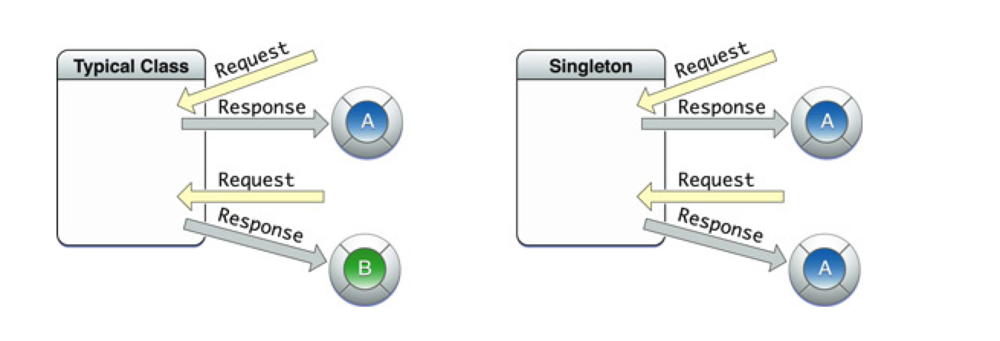

#单例

* [概念](#concept)
* [自定义单例](#shared)
* [系统单例](#system)
	* [NSUserDefaults](#NSUserDefaults)
	* [synchronize](#synchronize)
	* [举例](#example)

<span id = "concept">
##概念

单例:代表着无论你对它使用多少次都是使用的<font color = "red">**同一个**</font>对象



如果所示,一个普通的类创建的对象,如果经过几次创建会出来几个不同的对象,而单例在此只会创建出一个对象

比如在iOS开发中有时你会创建出一个购物车类,而这个购物车无论你在程序的什么地方访问都应该是同一个购物车,这个时候你就可以采取单例模式.

<span id = "shared">
##自定义单例

```objc
// 一般命名为shared开始
+ (instancetype)sharedCar
{
    static id instance = nil;
    static dispatch_once_t onceToken;
    // gcd中线程安全,只允许这段代码执行一次
    dispatch_once(&onceToken, ^{
        instance = [[self alloc] init];
    });
    return instance;
}
```


分析代码:

* 利用了<font color = "blue">static</font>关键字,这样以来该变量就会一直存储在静态区的,和系统同生共死.
* 利用gcd保证 `instance = [[self alloc] init];`这句代码只会执行一次,也就说明该对象一旦创建出来,就不会被重新创建

<span id = "system">
##系统单例

<span id = "NSUserDefaults">
###NSUserDefaults

这个单例可以帮助我们实现一些简单的本地化数据.

```objc
NSUserDefaults *user1 = [NSUserDefaults standardUserDefaults];
```

方法列表

```objc
- (void)setObject:(id)value forKey:(NSString *)defaultName;
- (void)removeObjectForKey:(NSString *)defaultName;

- (NSString *)stringForKey:(NSString *)defaultName;
- (NSArray *)arrayForKey:(NSString *)defaultName;
- (NSDictionary *)dictionaryForKey:(NSString *)defaultName;
- (NSData *)dataForKey:(NSString *)defaultName;
- (NSArray *)stringArrayForKey:(NSString *)defaultName;
- (NSInteger)integerForKey:(NSString *)defaultName;
- (float)floatForKey:(NSString *)defaultName;
- (double)doubleForKey:(NSString *)defaultName;
- (BOOL)boolForKey:(NSString *)defaultName;
- (NSURL *)URLForKey:(NSString *)defaultName NS_AVAILABLE(10_6, 4_0);

- (void)setInteger:(NSInteger)value forKey:(NSString *)defaultName;
- (void)setFloat:(float)value forKey:(NSString *)defaultName;
- (void)setDouble:(double)value forKey:(NSString *)defaultName;
- (void)setBool:(BOOL)value forKey:(NSString *)defaultName;
```

大家可以看到,在这里NSUserDefaults使用类似于字典,不管是取值还是存值,但是注意两点:

* key只能是字符串
* 支持基本数据类型存储

```objc
// 存储对象类型
[user1 setObject:@"zhangsan" forKey:@"name"];
// 存储基本类型
[user1 setInteger:18 forKey:@"age"];
// 取值
NSString *name = [user1 objectForKey:@"name"];
NSInteger age = [user1 integerForKey:@"age"];
```

<span id = "synchronize">
###synchronize

注意:这个方法会自动周期性的进行调用,所以大家在测试的时候,有时不调用该方法也可以取值.

```objc
// 该方法可以进行数据更新,进行本地化
- (BOOL)synchronize;
```

<span id = "example">
###举例

第一次执行这部分代码

```objc
NSUserDefaults *user1 = [NSUserDefaults standardUserDefaults];
// 存储对象类型
[user1 setObject:@"zhangsan" forKey:@"name"];
// 存储基本类型
[user1 setInteger:18 forKey:@"age"];
// 取值
NSString *name = [user1 objectForKey:@"name"];
NSInteger age = [user1 integerForKey:@"age"];
[user1 synchronize];
```

然后我们把代码删除,重新写上这部分代码

```objc
NSUserDefaults *user1 = [NSUserDefaults standardUserDefaults];
NSString *name = [user1 objectForKey:@"name"];
NSInteger age = [user1 integerForKey:@"age"];
NSLog(@"name = %@, age = %ld", name, age);
```

打印结果

```objc
2015-04-15 22:45:18.334 OC_Lesson5[2200:213278] name = zhangsan, age = 18
```

发现这次居然取出上次存储的值了,这就是因为NSUserDefaults可以进行数据持久化
