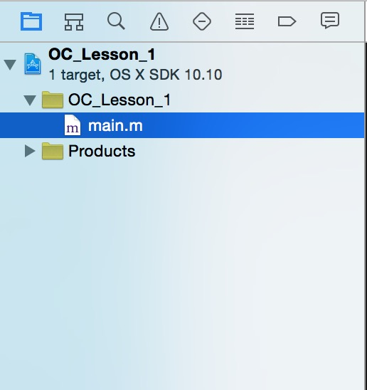

# 类与对象

##概念
类是现实世界或思维世界中的实体在计算机中的反映,它将数据以及这些数据上的操作封装在一起。
对象是具有类类型的变量。类和对象是面向对象编程技术中的最基本的概念。

##类和对象的关系
类是对象的抽象,而对象是类的具体实例。比如在我们平时生活的所说的一些事物,包括人类,老虎,电脑等等。注意这些名词都不是具体的某一个事物,而是一个抽象的存在,这就是类。那么如果说我的这台电脑,现在这个电脑就已经非常明确,这就是对象。

##类的创建

首先我们在XCode6中创建一个工程,如下界面

我们选择Command Line Tool,然后在下一个界面取好工程名字(OC_Lesson_1)以及组织名,并且注意语言选择Objective-c,然后依次向下选择。最后左侧会出现这个画面



现在我们选择main.m文件,大家会在右侧看到这样的一些代码, 在这里面我加上了自己的一些注释

```objc
// 引入了Foundation/Foundation.h这个头文件
// 大家可以按住command,然后将鼠标移到这里,最后点击进行,大家会看到很多的.h文件,也就说明这里的很多文件,我们通过这个Foundation.h就可以直接引入了
// #import 就是导入的意思
#import <Foundation/Foundation.h>

// 主函数
int main(int argc, const char * argv[]) {
    // 自动释放池,所有代码都应该写在这个池子里面,我们在讲解内存管理的时候会说到它的作用
    @autoreleasepool {
        // insert code here...
        // 类似于printf,输出一些信息,同样看到了熟悉了hello world!
        NSLog(@"Hello, World!");
    }
    return 0;
}

```

接下来我们来创建一个类,直接按住command + n 出现以下界面, 从左到右依次执行


这里当前类名我们填写Student（类命名规范首字母大写）,接着当前父类我们现在选择`NSObject`,语言选择`Objective-C`.


直接点击Next直到结束。

大家现在可以看到XCode左侧目录栏已经多出两个文件`Student.h`以及`Student.m`

```objc

// .h 文件, 同样引入了Foundation.h文件
#import <Foundation/Foundation.h>

// 大家可能已经注意到@这个符号,待会我们来进行一个总结
// 这里翻译过来,就知道这是一个接口文件,那就说明.h文件是给外界提供接口的一个存在
// 在冒号后面紧跟的就是当前父类的名字
@interface Student : NSObject
// 注意所有的代码都写在这里面, @end之前

// 接下来我们创建一些成员变量,注意大括号
成员变量的常用作用域有3种：
1> @public 全局都可以访问
2> @protected 只能在类内部和子类中访问
3> @private 只能在类内部访问
默认是@protected
{
    // 命名规范,一般都是以下划线开始
    NSString *_name;    // 姓名,NSString类型,我们在后面会介绍,这是一种OC字符串类型
    NSString *_sex;     // 性别
    int _age;           // 年龄
}


@end

```
接下来我们来查看.m文件

```objc

// .m文件
// 引入了.h文件

#import "Student.h"

@implementation Student
// 同样实现部分都写在这里面

@end

```

随后我们切换到main.m文件中,我们已经创建好了一个Student类,那么现在我们就在main.m文件中创建一个Student类的对象。修改之后我们的mian.m文件如下：

```objc
#import <Foundation/Foundation.h>

// 第一步在这里引入相应的头文件
#import "Student.h"

// 主函数
int main(int argc, const char * argv[]) {
    // 自动释放池,所有代码都应该写在这个池子里面,我们在讲解内存管理的时候会说到它的作用
    @autoreleasepool {
        // insert code here...
        // 类似于printf,输出一些信息,同样看到了熟悉了hello world!
        NSLog(@"Hello, World!");

        // 第二步声明变量,并且初始化
		 // 这里使用到了两个方法,我们在第二讲会具体讲解什么是方法
        // alloc 分配空间
        // init 初始化
        Student *stu = [[Student alloc] init];

        // 输出stu
        NSLog(@"%@", stu);

    }
    return 0;
}

```

最后我们来进行一个简单的总结：

@的作用

1. 打印对象类型使用`%@`当作占位符
2. 关键字的起始标识
3. OC一些数据类型的起始,比如`@"Hello, World!"`

创建对象的过程

1. 创建一个自定义类
2. 使用NSObject方法 alloc 以及 init 进行分配空间,初始化
3. 就可以使用对象了

