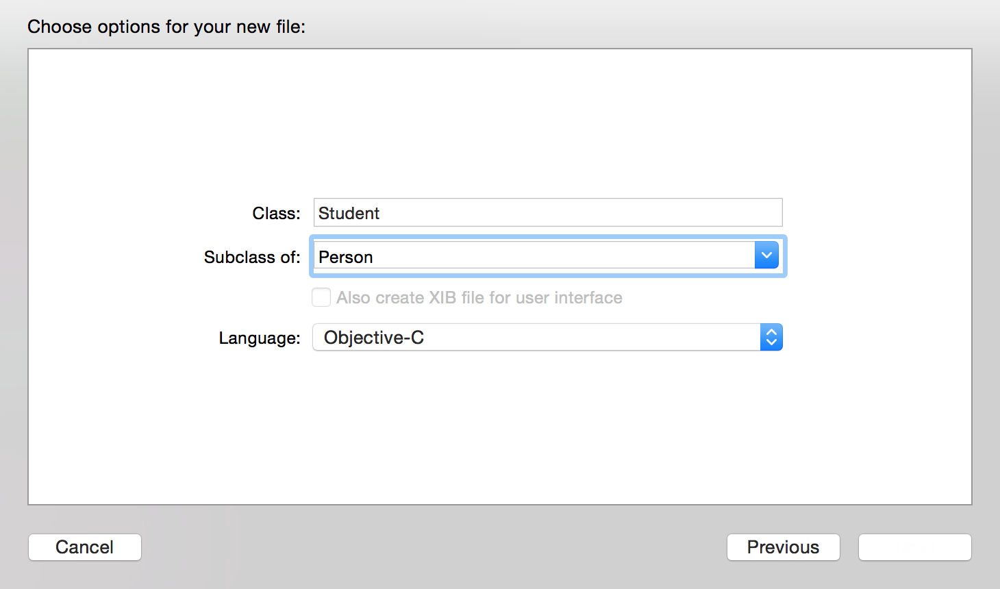

# 方法与继承

##方法

OC中方法主要分为两种，一种+号开始的类方法，另一种就是-号开始的实例方法。

```objc
// 这就是上一章所讲到的创建对象所调用的两个方法，他们都是NSObject下面的方法。
+ (instancetype)alloc;	// 分配空间	
- (instancetype)init;	// 进行初始化
```

###自定义方法
接下来我们还是按照第一章所讲的步骤先创建一个Person类，然后为其添加一些独特的方法。

然后在.h文件中去声明两个方法

```objc

@interface Person : NSObject
{
    NSString *_name;
    int _age;
}

// 方法书写规范

/* 确定加号还是减号 (当前方法返回类型)方法名
 * 如果有参数接着书写冒号:(参数数据类型)变量名1 描述名:(数据类型)变量名2 ...
 * 所有可以添加很多参数，也可以不添加参数
 * 下面就书写了两个方法，一个是有参数有返回值的，一个是无返回值无参数的
 */

// 自定义初始化方法以 initWith开始
- (instancetype)initWithName:(NSString *)name age:(int)age;


- (void)sayHello;


```

然后进入.m文件我们分别实现这两个方法


```objc
#import "Person.h"

@implementation Person

- (instancetype)initWithName:(NSString *)name age:(int)age
{
	// 这三部在初始化方法中，必不可少，大家可以认为这是一个模板
    self = [super init];
    if (self) {
        // 要进行的赋值操作，全部在这里执行
    }
    return self;
}


- (void)sayHello
{
    
}

@end
```
完整的代码如下:

```objc

@implementation Person

- (instancetype)initWithName:(NSString *)name age:(int)age
{
    self = [super init];
    if (self) {
        // 要进行的赋值操作，全部在这里执行   
        _name = name;
        _age = age;
        
    }
    return self;
}


- (void)sayHello
{
    NSLog(@"hello world!");
}

@end

```

接着我们在.h文件中去声明一个+号方法 .m中实现该方法

```objc

// 类方法 + 号开始
+ (void)fly;


// 实现部分
+ (void)fly
{
    NSLog(@"Person can't fly!");
}


```

###方法调用


方法我们已经写好了，接着我们就要来学习怎么去调用一些方法了，我们切换到main.m这个文件中去，同样


同样第一步

```objc
#import "Person.h"
```

接着我们在main函数中接着调用这两个方法创建一个对象

```objc
Person *person = [[Person alloc] init];
```

最后我们来调用我们刚才所写的几个方法，首先是自定义初始化方法，大家可以与上面对比一下，下面这种是我们想在初始化一个对象的时候给上对象的成员变量赋值。

比如大家在网站上注册QQ的时候，网站会让你事先填写一些关于QQ的信息，最后才会反馈给你一个QQ号码。所以我们经常会使用到**自定义初始化方法**。


```objc
// 创建了一个新的对象， 该对象中的姓名以及年龄就是现在所给的值了。
 Person *newPerson = [[Person alloc] initWithName:@"zhangsan" age:18];      
 // 那么我们怎么去访问这些值呢？
 // 我们需要用到 setter & getter方法了。

```

我们现在就需要去创建相应的`setter`以及`getter`方法。我们现在切换到`Person.h`文件

```objc
// getter methods
// 命名规范: - (返回值类型和成员变量相匹配)方法名
// 方法名书写成成员变量去掉下划线的名字
// 如下
- (NSString *)name;
- (int)age;

// setter methods
// 命名规范: - (void)set成员变量去掉下划线的名字:(数据类型)变量名
// 如下
- (void)setName:(NSString *)name;
- (void)setAge:(int)age;

```

然后我们在`person.m`文件中实现这些方法

```objc
// 简单的取值操作,返回相应的成员变量即可
- (NSString *)name
{
    return _name;
}

- (int)age
{
    return _age;
}

// 赋值操作
- (void)setName:(NSString *)name
{
    _name = name;
}

- (void)setAge:(int)age
{
    _age = age;
}

```

最后我们在main.m文件中去访问这些数据

```objc
// 使用getter方法，取值  person.name 在这里就等价于 [person name] 调方法的形式
NSLog(@"person.name = %@, person.age = %d", person.name, person.age);
NSLog(@"newPerson.name = %@, newPerson.age = %d", newPerson.name, newPerson.age);
// 使用setter方法，赋值 这里就等价于 [person setName:@"lisi"];
person.name = @"lisi";
person.age = 10;
   
NSLog(@"person.name = %@, person.age = %d", person.name, person.age);

 // 最后我们使用类方法来测试一下，和上面唯一不同的是，只需要类名就可以调用该方法了。
 [Person fly];

```

大家可能已经注意到，如果我们遵守系统这种命名方式，是可以使用一种的新的语法（点语法）的方式去调用方法。所以在上面写道和调用方法的本质其实一模一样的。大家也可以运行试试效果，可以看到后面打印person的时候就有名字以及年龄了。


##继承
继承使得众多类之间有了层次关系，下层的类能够具备上层类的非私有属性和方法，还可以根据自己的需要添加新的属性和方法。

上层的类即被继承的类，叫超类/父类（superClass）。下层的类叫子类(subClass)

而在现实生活中，比如我们会说到老虎是属于食肉动物，而食肉动物又属于动物的一种。这些都是在描述继承这一存在。

我们在XCode中来创建一个Student类，大家可能也会想到Student也会拥有姓名，年龄这两个属性，可能还有一些比较独特的属性，比如说成绩，学号等等。那在你写完这个类的时候，你会发现有很多代码其实都是和Person这个类中实现是一样的。而如果我们现在再去创建一个Teacher类，同样也拥有姓名，年龄这两个属性，以及一些独特的属性。这样去创建这两个类会显得非常麻烦，并且代码也比较冗余。

那我们就想象一下，其实Student和Teacher都是人类的一种，他们都拥有人类的共性，如果说能够把这些共性提取出来，那代码方法易于维护，并且代码也比较简洁

其实我们在之前已经使用到了继承：

```objc
+ (instancetype)alloc;
- (instancetype)init;
```
这两个方法我们之前已经使用过，但是我们却没有在Person.h文件中声明这两个方法，是因为我们继承与NSObject,我们就拥有所有父类公开的成员变量以及属性。

```objc
@interface Person : NSObject // 父类
```
接下来，我们来创建一个类Student，让Student继承与Person，如下



然后进入到Student.h文件

```objc
#import "Person.h"

@interface Student : Person	// 现在不是直接继承与NSObject，而是Perosn
// 添加上独特的成员变量以及方法
{
    float _score;
}

// setter & getter;
- (void)setScore:(float)score;
- (float)score;

@end

```


切换到Student.m文件

```objc
@implementation Student

// setter & getter;
- (void)setScore:(float)score
{
    _score = score;
}
- (float)score
{
    return _score;
}

@end

```

最后我们同样进入main.m文件中创建一个Student类

同样第一步

```objc
#import "Student.h"
```

然后我们在main函数中

```objc
// 使用父类的方式进行初始化
Student *stu = [[Student alloc] initWithName:@"student" age:18];
// 调用自身的setter方法
stu.score = 18;
// 输出信息
NSLog(@"stu.name = %@, stu.age = %d, stu.score = %.2f", stu.name, stu.age, stu.score);

```

相信大家已经注意到，当Student继承与Person以后，Student拥有Person所有的成员变量以及方法，并且都可以使用，这就是继承的体现。


###方法重写
当我们进行继承以后，我们拥有父类的所有公开方法，那么就存在一个问题了，比如说学生继承与人，人拥有一个work这个方法，那么学生也拥有这个方法了。我们在Person.h文件以及.m文件中添加这个方法

```objc

// .h
- (void)work;

// .m
- (void)work
{
    NSLog(@"人类的工作时间不定");
}

```
但是我们现在学生却想自己重写实现这个方法，想在这个方法中输出，学生每天学习大概8个小时，我们这个时间就需要用到方法重写。

在重写之前大家首先在main函数中进行调用

```objc
[stu work];

2015-04-11 22:00:38.195 OC_Lesson2[20133:1738432] 人类的工作时间不定

```

在Student.m文件

```objc

- (void)work
{
    NSLog(@"学生每天学习大概8个小时");
}

```

然后我们再次运行，打印信息如下：

```objc

2015-04-11 22:02:08.049 OC_Lesson2[20143:1739663] 学生每天学习大概8个小时

```

###description方法

```objc
NSLog(@"stu = %@", stu);
// 打印信息如下
2015-04-11 22:03:24.035 OC_Lesson2[20154:1741035] stu = <Student: 0x100500310>
```
但是有些时候，我们希望打印一个对象的时候就能够打印出其相对于的成员变量，比如说我们打印这个字符串，就能够马上看到这些字符，而不是我们上面所看到的地址

所以我们现在就需要重写父类的description方法（NSObject的一个方法）

现在我们切入到Student.m文件中

```objc
- (NSString *)description
{
    return [NSString stringWithFormat:@"name = %@, age = %d, score = %.2f", _name, _age, _score];
}
```
然后我们重新运行，可以发现打印信息改变成:

```objc

2015-04-11 22:08:00.771 OC_Lesson2[20168:1746444] stu = name = student, age = 18, score = 18.00

```
这就是description的作用，改变你希望该对象打印出的一种格式，当然你也可以试着自己试试相应的格式。

